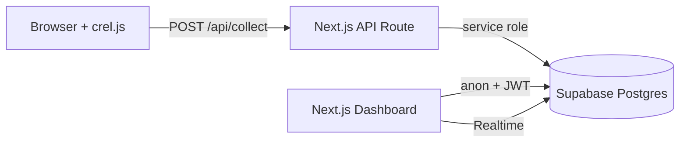

# Crel Architecture

## Overview

Crel is a privacy-first, open-source web analytics platform. It follows an **Umami-style** architecture: a tiny browser SDK sends events to a collect API; data lives in **Supabase Postgres**; the **Next.js App Router** dashboard reads via RLS-protected queries and **Supabase Realtime**.



## Tech decisions

| Layer | Choice | Rationale |
|-------|--------|-----------|
| Framework | Next.js 16 App Router | Already in repo; Vercel-native, RSC for dashboard |
| UI | shadcn/ui + Tailwind v4 | Accessible components, dark mode, fast iteration |
| Charts | **Recharts** | React-native, composable, no extra design system lock-in (vs Tremor) |
| Database | Supabase Postgres | Managed Postgres + Auth + Realtime in one OSS stack |
| Auth | Supabase Auth | Email/password; websites owned per user |
| Tracker | Vanilla `public/crel.js` | No bundle on customer sites; target &lt;6KB gzip |
| Ingest | Route Handler + service role | Bypasses RLS safely; rate limit + bot filter at edge |

## Data model

- **websites** — owned by `user_id`, one `tracking_id` per site (public ingest key)
- **sessions** — visitor session, UTM, device, bounce, duration
- **pageviews** — path-level hits
- **events** — partitioned monthly JSONB properties
- **daily_stats** — optional rollup table for Phase 2

## Security

1. **Collect API**: service role only; rate limit per IP; bot UA filter; CORS `*` for tracker origins (tighten per-website in production).
2. **Dashboard**: Supabase RLS — users only read their own websites.
3. **Tracking ID**: public but useless without matching session payloads; optional domain allowlist in `websites.settings`.

## Folder layout

```
app/
  (marketing)/          # Landing
  (auth)/login|signup
  (dashboard)/dashboard/[websiteId]
  api/collect           # Ingest
  api/analytics/[id]    # JSON API for client refresh
components/dashboard/   # Charts, tables, sidebar
lib/analytics/          # Queries + ingest
lib/supabase/           # Clients
public/crel.js          # Tracker SDK
supabase/migrations/    # SQL schema
```

## Phased roadmap

See [README.md](../README.md#implementation-roadmap).
